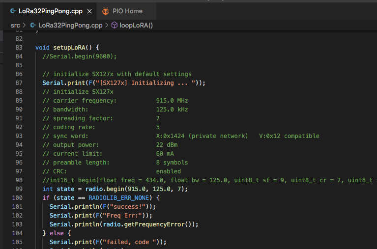
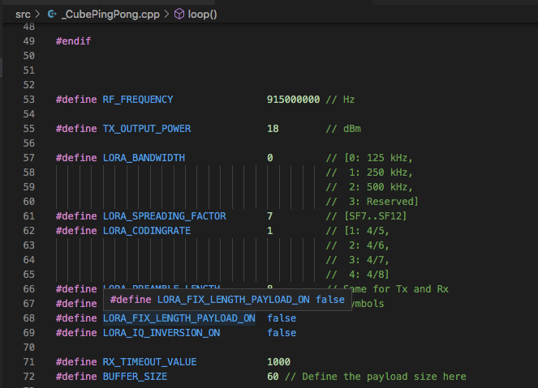
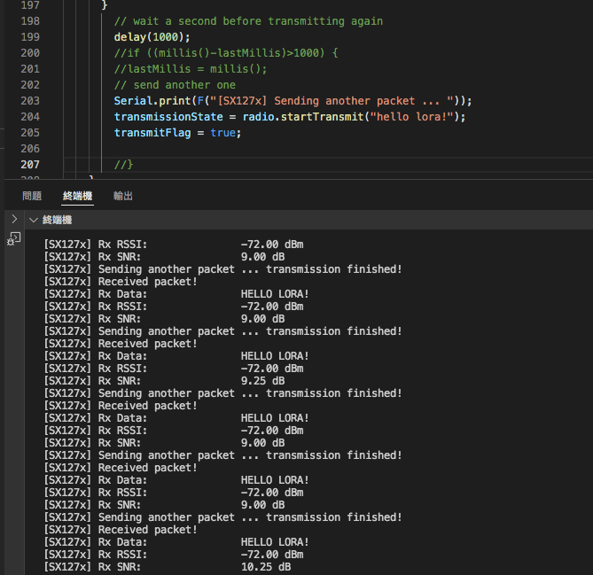

# LoRa_PingPong
PingPong test w/ LoRa32 &amp; CubeCell

### LoRA32 as the initiator, sending "hello lora!", LORA settings as following... 
 

### CubeCell as the responder, receiving and sending back "HELLO LORA!", LORA settings as following... 
 
 

### PingPong Result

## References
[Heltec Arduino](https://github.com/HelTecAutomation/CubeCell-Arduino)  
[Heltec PlatformIO ASRM650x](https://github.com/HelTecAutomation/platform-asrmicro650x)  
[RadioLib Arduino Library](https://github.com/jgromes/RadioLib)  
